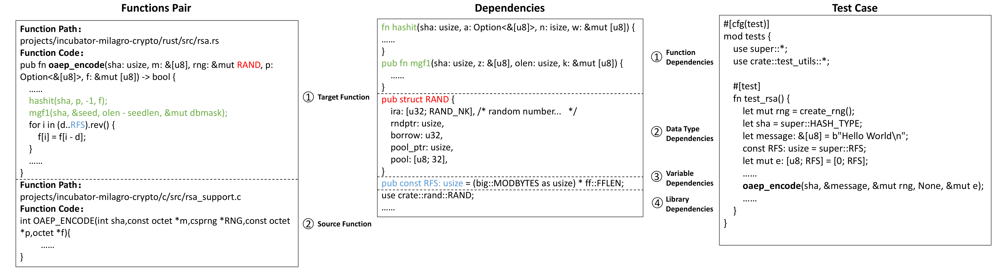

# Evaluating Large Language Models in Repository-level Code Translation
RustRepoTrans is the first repository-level code translation benchmark described in the paper "RustRepoTrans: Repository-level Code Translation Benchmark Targeting Rust". Feel free to contact us to submit new results.

## Benchmark Dataset
RustRepoTrans, the first repository-level code translation benchmark comprising 375 tasks targeting Rust, consists of 122 java-rust function pairs, 145 c-rust function pairs and 108 python-rust function pairs, complete with relevant dependencies and test cases that have an average coverage of over 90%.


## Benchmark Format
Each code translation task in RustRepoTrans consists of a pair of functions along with their relevant dependencies, formatted as <source function, target function, target function dependencies, target function test cases>.
The function pairs <source function, target function>represent functionally equivalent code snippets from the source and target languages, along with their respective file paths. The target function dependencies include elements such as function dependencies, data type dependencies, variable dependencies, and library dependencies related to the target function.

In this benchmark, the source function, target function signature, and associated dependencies
serve as input, with the goal for LLMs to generate a complete target function. The correctness of
this generated function can then be verified using the associated test cases.


Functions Pair are in folder *Evaluate/function_pair_with_identical_functionality*, Dependencies are in folder *Evaluate/related_functions_and_datatypes_and_import*, Test Cases are in original projects(Since functions with dependencies require the original project to compile successfully, their corresponding test cases are also located within the original project.) 


## Usage
Ensure you're using the right setup and following the proper directory structure to evaluate repository-level code translation with our tool.

### Setup
1. Environment Setup

*  Ensure you're running Python 3.8 or newer. We recommend setting up a virtual environment:
```
$ conda create -n RustRepoTrans python=3.8
$ conda activate RustRepoTrans
```

* Install rust through [Rust Official Documentation](https://www.rust-lang.org/tools/install)


2. Repository Setup

```
$ cd RustRepoTrans
$ pip install -r requirements.tet
```

### Evaluate
1. Replace the target LLM in the function ```generation(message)``` of  ```Evaluate/generation.py```  
2. Run the script with arguments
```
$ cd Evaluate
$ ./run.sh function_pair_folder_path  target_llm_name dependencies_folder_path
$ # for example: ./run.sh function_pair_with_identical_functionality claude related_functions_and_datatypes_and_import
```

### Dataset Construction
1. Replace the target LLM in the function ```generation(message)``` of ```Dataset_Construction/generation.py``` 
2. Replace the target project with different language version in ```Dataset_Construction/projects```
3. Run the script with arguments
```
$ cd Dataset_Construction
$ ./run.sh
```

## Results
translatation result and test result of studied LLMs on RustRepoTrans are [here](results/rq1)

Error Casuse analysis of studied LLMs on RustRepoTrans are [here](results/rq4)

LLMs' Ability of Noise Robustness and Syntactical Differences Identification are [here](results/rq5)